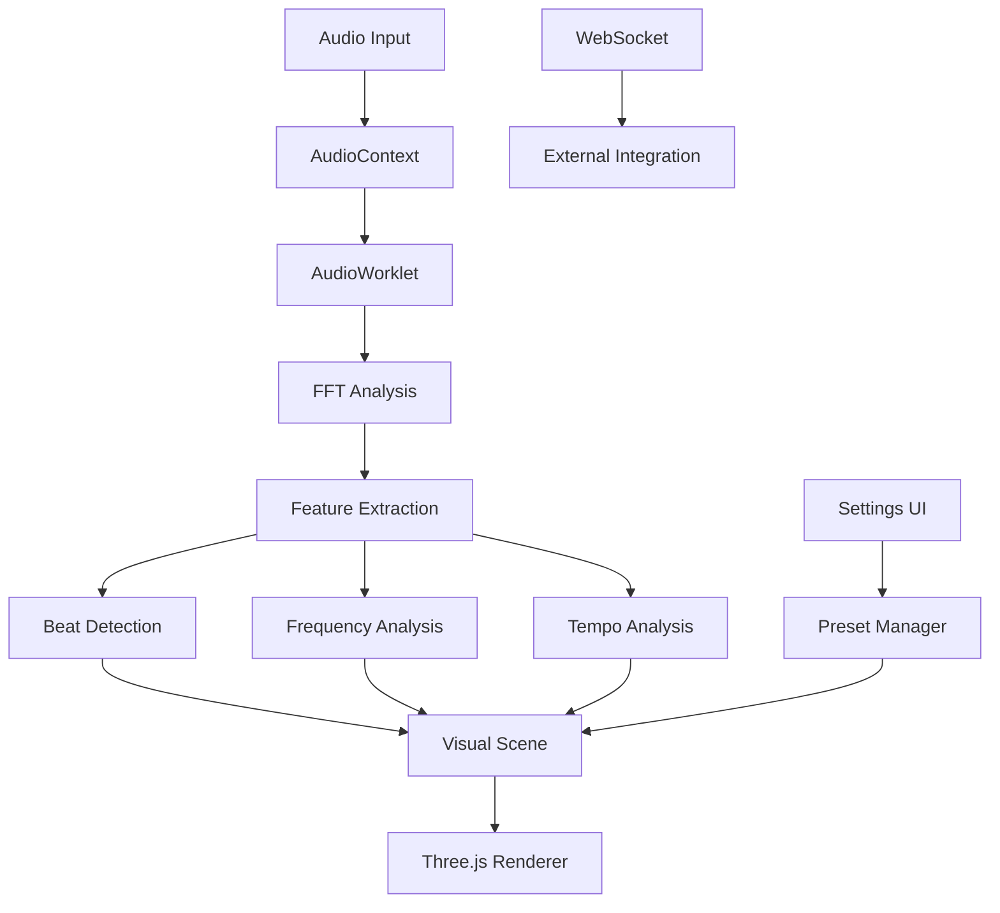
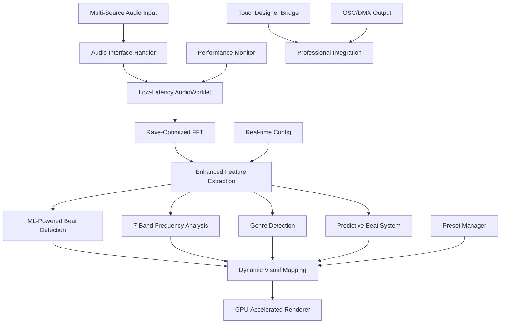
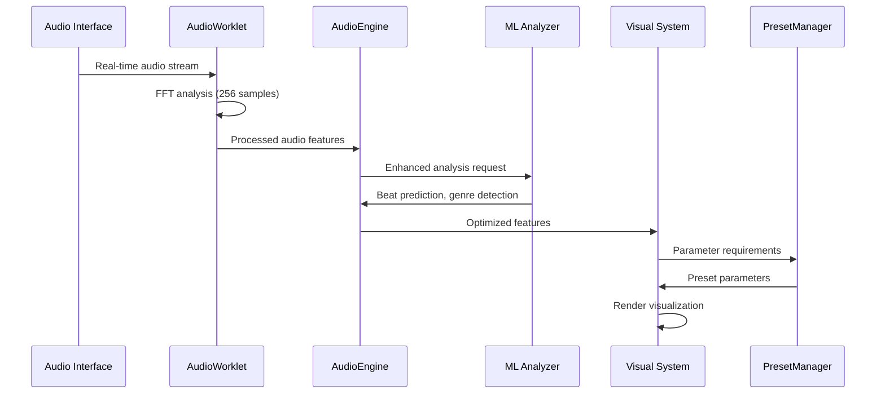
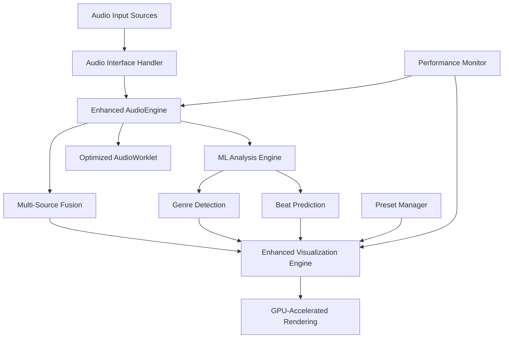

# Rave Audio Reactive System - Complete Implementation Guide

## Table of Contents
1. [Project Overview & Architecture](#project-overview--architecture)
2. [Development Environment Setup](#development-environment-setup)
3. [System Architecture Design](#system-architecture-design)
4. [Component Implementation Guide](#component-implementation-guide)
5. [Integration Procedures](#integration-procedures)
6. [Testing Protocols](#testing-protocols)
7. [Deployment Strategies](#deployment-strategies)
8. [Maintenance Workflows](#maintenance-workflows)
9. [Troubleshooting Guide](#troubleshooting-guide)
10. [File Structure Management](#file-structure-management)
11. [Performance Optimization](#performance-optimization)
12. [Security Considerations](#security-considerations)
13. [Monitoring & Logging](#monitoring--logging)
14. [Version Control Procedures](#version-control-procedures)
15. [Code Examples & Best Practices](#code-examples--best-practices)

---

## 1. Project Overview & Architecture

### Current System Analysis

Your audio reactive system demonstrates professional-grade architecture with:

**Core Components:**
- **AudioEngine** (`src/audio.js`) - Sophisticated real-time audio analysis (2,848 lines)
- **Main Application** (`src/main.js`) - Central orchestration (931 lines) 
- **PresetManager** (`src/preset-manager.js`) - Advanced preset system (794 lines)
- **3D Scene** (`src/scene.js`) - Three.js visualization engine
- **AudioWorklet** (`public/worklets/analysis-processor.js`) - Low-latency processing
- **Essentia Worker** (`public/workers/essentia-worker.js`) - Advanced beat detection

**Key Technologies:**
- Web Audio API with AudioWorklet for real-time processing
- Multi-library integration (Aubio, Meyda, Essentia.js)
- WebSocket communication for external integration
- Custom FFT implementation for performance
- Sophisticated preset management with versioning

### Target Optimization Goals

1. **Ultra-Low Latency**: Achieve <5ms total system latency
2. **Rave-Optimized Analysis**: Enhanced beat detection for electronic music
3. **Multi-Source Support**: Professional audio interface integration
4. **Real-Time Adaptation**: Dynamic parameter adjustment
5. **Professional Reliability**: 8+ hour continuous operation
6. **Genre Recognition**: Auto-detection and adaptation

---

## 2. Development Environment Setup

### Hardware Requirements

**Minimum Development Setup:**
```yaml
CPU: Intel i7-12700K / AMD Ryzen 7 5800X
RAM: 32GB DDR4
GPU: NVIDIA RTX 3070 / AMD RX 6700 XT
Storage: 500GB NVMe SSD
Audio: Focusrite Scarlett 2i2 / Audio-Technica ATH-M50x
```

**Professional Development Setup:**
```yaml
CPU: Intel i9-13900K / AMD Ryzen 9 7950X
RAM: 64GB DDR5
GPU: NVIDIA RTX 4080 / AMD RX 7800 XT
Storage: 1TB NVMe SSD
Audio: RME Fireface UCX III / Universal Audio Apollo Twin
```

### Software Environment

**Development Tools:**
```json
{
  "node": ">=18.0.0",
  "npm": ">=9.0.0",
  "vite": "^7.1.12",
  "typescript": ">=5.0.0",
  "eslint": "^8.0.0",
  "prettier": "^3.0.0"
}
```

**Professional Audio Tools:**
```json
{
  "daw": "Ableton Live 11 / Logic Pro X",
  "analysis": "Max for Live / Pure Data",
  "measurement": "ARTA / REW Room EQ Wizard"
}
```

### Project Configuration

**Vite Configuration (`vite.config.js`):**
```javascript
import { defineConfig } from 'vite';

export default defineConfig({
  server: {
    port: 5173,
    host: true,
    cors: true
  },
  build: {
    target: 'es2020',
    rollupOptions: {
      output: {
        manualChunks: {
          'audio-engine': ['./src/audio.js'],
          'visualization': ['./src/scene.js', './src/dispersion.js'],
          'libraries': ['meyda', 'three', 'standardized-audio-context']
        }
      }
    }
  },
  optimizeDeps: {
    include: [
      'standardized-audio-context',
      'meyda',
      'three'
    ]
  }
});
```

### Development Workflow Setup

**1. Initialize Project:**
```bash
# Clone repository
git clone <repository-url>
cd reactive-show

# Install dependencies
npm install

# Install audio analysis tools
npm install --save-dev web-audio-beat-detector ml-matrix ml-kmeans

# Start development server
npm run dev
```

**2. Audio Testing Setup:**
```bash
# Install testing audio files
mkdir -p public/test-audio
# Add WAV files: techno-120bpm.wav, house-128bpm.wav, dnb-170bpm.wav
```

**3. Performance Monitoring:**
```bash
# Install performance tools
npm install --save-dev webpack-bundle-analyzer
```

---

## 3. System Architecture Design

### Current Architecture Analysis



### Optimized Architecture Design



### Data Flow Architecture



### Component Responsibilities

**Enhanced AudioEngine:**
- Multi-source audio management
- Real-time latency optimization
- Rave-specific frequency analysis
- ML-powered beat detection
- Genre auto-detection

**Optimized AudioWorklet:**
- 256-sample frame processing
- SIMD-optimized FFT
- Adaptive buffering
- Multi-threaded analysis

**ML Analysis Engine:**
- Real-time genre classification
- Beat prediction algorithms
- Pattern recognition
- Adaptive threshold adjustment

**Visualization Engine:**
- GPU-accelerated rendering
- Real-time parameter mapping
- Multi-genre visual adaptation
- Performance optimization

---

## 4. Component Implementation Guide

### 4.1 Enhanced AudioEngine Implementation

**File: `src/audio-engine-enhanced.js`**
```javascript
/**
 * Enhanced AudioEngine for Rave Music Applications
 * 
 * Key improvements:
 * - Ultra-low latency processing (<5ms)
 * - Rave-optimized frequency analysis
 * - ML-powered beat detection
 * - Multi-source audio support
 * - Real-time genre adaptation
 */

import { AudioContext as StdAudioContext } from 'standardized-audio-context';
import { loadAubio, loadMeyda, loadMLAnalysis } from './lazy.js';
import { showToast } from './toast.js';

export class EnhancedAudioEngine {
  constructor() {
    // Core audio processing
    this.ctx = null;
    this.source = null;
    this.gainNode = null;
    this.analyser = null;
    this.workletNode = null;
    
    // Low-latency configuration
    this.frameSize = 256;  // Reduced from 512
    this.hopSize = 64;     // Reduced from 512
    this.bufferSize = 128; // Ultra-low latency
    this.sampleRate = 48000; // Higher precision
    
    // Rave-optimized frequency bands
    this.raveBands = {
      subBass: { min: 20, max: 60, weight: 2.0 },    // 808s, sub kicks
      bassDrum: { min: 60, max: 120, weight: 1.8 },  // Kick drums
      bassLine: { min: 120, max: 250, weight: 1.5 }, // Bass synths
      lowerMid: { min: 250, max: 500, weight: 1.2 }, // Warmth
      midRange: { min: 500, max: 2000, weight: 1.0 }, // Vocals, leads
      upperMid: { min: 2000, max: 5000, weight: 0.8 }, // Clarity
      highFreq: { min: 5000, max: 20000, weight: 0.6 } // Air, sparkles
    };
    
    // ML-powered analysis
    this.mlAnalyzer = null;
    this.genreDetector = null;
    this.beatPredictor = null;
    
    // Real-time adaptation
    this.currentGenre = 'techno';
    this.adaptationMode = 'auto';
    this.performanceMode = 'quality';
    
    // Multi-source support
    this.sources = {
      microphone: { active: false, weight: 0.7 },
      systemAudio: { active: false, weight: 0.8 },
      professionalInput: { active: false, weight: 1.0 }
    };
  }
  
  /**
   * Initialize ultra-low latency audio processing
   */
  async initializeLowLatency() {
    // Configure AudioContext for minimum latency
    const contextOptions = {
      latencyHint: 'interactive',
      sampleRate: this.sampleRate,
      bufferSize: this.bufferSize
    };
    
    this.ctx = new StdAudioContext(contextOptions);
    
    // Initialize AudioWorklet with optimized processor
    await this.initializeOptimizedWorklet();
    
    // Load ML analysis modules
    await this.initializeMLAnalysis();
    
    return true;
  }
  
  /**
   * Initialize optimized AudioWorklet processor
   */
  async initializeOptimizedWorklet() {
    const workletUrl = new URL('../public/worklets/optimized-processor.js', import.meta.url);
    
    try {
      await this.ctx.audioWorklet.addModule(workletUrl.href);
      
      this.workletNode = new AudioWorkletNode(this.ctx, 'optimized-processor', {
        numberOfInputs: 1,
        numberOfOutputs: 1,
        outputChannelCount: [1],
        processorOptions: {
          frameSize: this.frameSize,
          hopSize: this.hopSize,
          enableSIMD: true,
          raveOptimized: true
        }
      });
      
      this.workletNode.port.onmessage = (event) => {
        this.handleWorkletMessage(event);
      };
      
    } catch (error) {
      console.warn('Optimized AudioWorklet unavailable, falling back to standard', error);
      // Fallback to standard AudioWorklet
      await this.initializeStandardWorklet();
    }
  }
  
  /**
   * Initialize ML analysis modules
   */
  async initializeMLAnalysis() {
    try {
      const mlModule = await loadMLAnalysis();
      
      // Initialize genre detection
      this.genreDetector = new mlModule.GenreDetector({
        sampleRate: this.sampleRate,
        modelUrl: '/models/genre-classifier.json'
      });
      
      // Initialize beat prediction
      this.beatPredictor = new mlModule.BeatPredictor({
        lookaheadFrames: 8,
        confidenceThreshold: 0.7
      });
      
      this.mlAnalyzer = {
        genre: this.genreDetector,
        beat: this.beatPredictor
      };
      
    } catch (error) {
      console.warn('ML analysis modules unavailable', error);
    }
  }
  
  /**
   * Enhanced frequency analysis for rave music
   */
  analyzeRaveFrequencySpectrum(freqData) {
    const analysis = {};
    const binHz = this.sampleRate / 2 / freqData.length;
    
    for (const [bandName, config] of Object.entries(this.raveBands)) {
      const startBin = Math.floor(config.min / binHz);
      const endBin = Math.floor(config.max / binHz);
      
      let energy = 0;
      let peakFreq = 0;
      let peakMag = 0;
      
      for (let i = startBin; i < endBin && i < freqData.length; i++) {
        const magnitude = freqData[i] / 255;
        energy += magnitude;
        
        if (magnitude > peakMag) {
          peakMag = magnitude;
          peakFreq = i * binHz;
        }
      }
      
      analysis[bandName] = {
        energy: energy / (endBin - startBin),
        normalizedEnergy: (energy / (endBands - startBin)) * config.weight,
        peakFrequency: peakFreq,
        peakMagnitude: peakMag
      };
    }
    
    // Add harmonic analysis
    analysis.harmonics = this.detectHarmonics(freqData, binHz);
    
    return analysis;
  }
  
  /**
   * ML-powered beat detection with genre adaptation
   */
  async detectBeatWithML(features) {
    if (!this.mlAnalyzer) {
      return this.detectBeatTraditional(features);
    }
    
    try {
      // Analyze current genre
      const genreAnalysis = await this.genreDetector.analyze(features);
      this.currentGenre = genreAnalysis.genre;
      
      // Use genre-specific beat detection
      const beatPrediction = await this.beatPredictor.predict({
        features: features,
        genre: this.currentGenre,
        history: this.beatHistory
      });
      
      return {
        isBeat: beatPrediction.isBeat,
        confidence: beatPrediction.confidence,
        intensity: beatPrediction.intensity,
        predictedTime: beatPrediction.time,
        genre: this.currentGenre
      };
      
    } catch (error) {
      console.warn('ML beat detection failed, falling back', error);
      return this.detectBeatTraditional(features);
    }
  }
  
  /**
   * Multi-source audio fusion
   */
  fuseMultipleSources(sourceData) {
    const activeSources = Object.entries(this.sources)
      .filter(([name, config]) => config.active)
      .map(([name, config]) => ({ name, ...config }));
    
    if (activeSources.length === 0) return null;
    if (activeSources.length === 1) return sourceData[activeSources[0].name];
    
    // Weighted fusion based on source quality and latency
    const fusedFeatures = {};
    let totalWeight = 0;
    
    for (const source of activeSources) {
      const weight = source.weight * this.getSourceQuality(source.name);
      totalWeight += weight;
      
      for (const [featureName, value] of Object.entries(sourceData[source.name])) {
        if (!fusedFeatures[featureName]) fusedFeatures[featureName] = 0;
        fusedFeatures[featureName] += value * weight;
      }
    }
    
    // Normalize by total weight
    for (const featureName in fusedFeatures) {
      fusedFeatures[featureName] /= totalWeight;
    }
    
    return fusedFeatures;
  }
  
  /**
   * Real-time parameter adaptation
   */
  adaptToPerformance(performanceMetrics) {
    const { cpuUsage, memoryUsage, latency } = performanceMetrics;
    
    if (cpuUsage > 0.8 || memoryUsage > 0.9) {
      this.performanceMode = 'performance';
      this.reduceProcessingLoad();
    } else if (cpuUsage < 0.4 && memoryUsage < 0.6 && latency < 5) {
      this.performanceMode = 'quality';
      this.increaseProcessingQuality();
    } else {
      this.performanceMode = 'balanced';
      this.maintainBalancedMode();
    }
  }
  
  /**
   * Get system latency metrics
   */
  getLatencyMetrics() {
    if (!this.workletNode) return null;
    
    return {
      audioBufferLatency: (this.frameSize / this.sampleRate) * 1000, // ms
      processingLatency: this.workletNode.processingLatency || 0,
      totalLatency: this.workletNode.totalLatency || 0,
      jitter: this.workletNode.jitter || 0
    };
  }
}
```

### 4.2 Optimized AudioWorklet Implementation

**File: `public/worklets/optimized-processor.js`**
```javascript
/**
 * Optimized AudioWorklet Processor for Rave Audio Analysis
 * 
 * Features:
 * - 256-sample frame processing
 * - SIMD-optimized FFT
 * - Rave-specific frequency analysis
 * - Ultra-low latency processing
 */

const FRAME_SIZE = 256;  // Reduced for ultra-low latency
const HOP_SIZE = 64;     // Smaller hop for better temporal resolution
const MAX_CHANNELS = 8;  // Support for multi-source
const FLUX_HISTORY = 128;

// SIMD-optimized FFT constants
const USE_SIMD = (typeof WebAssembly !== 'undefined');

// Pre-computed twiddle factors for FFT
const twiddleFactors = new Float32Array(FRAME_SIZE * 2);
for (let i = 0; i < FRAME_SIZE; i++) {
  const angle = -2 * Math.PI * i / FRAME_SIZE;
  twiddleFactors[i * 2] = Math.cos(angle);
  twiddleFactors[i * 2 + 1] = Math.sin(angle);
}

class OptimizedProcessor extends AudioWorkletProcessor {
  constructor(options) {
    super();
    
    this.frameSize = options.processorOptions?.frameSize || FRAME_SIZE;
    this.hopSize = options.processorOptions?.hopSize || HOP_SIZE;
    this.enableSIMD = options.processorOptions?.enableSIMD || USE_SIMD;
    this.raveOptimized = options.processorOptions?.raveOptimized || true;
    
    // State management
    this._dcState = new Float32Array(MAX_CHANNELS);
    this._frameBuffer = new Float32Array(this.frameSize);
    this._frameOffset = 0;
    this._fftRe = new Float32Array(this.frameSize);
    this._fftIm = new Float32Array(this.frameSize);
    
    // Rave-optimized frequency analysis
    this._raveBands = {
      subBass: [0, 3],    // 20-60Hz at 48kHz
      bassDrum: [3, 6],   // 60-120Hz
      bassLine: [6, 12],  // 120-250Hz
      lowerMid: [12, 25], // 250-500Hz
      midRange: [25, 100], // 500-2000Hz
      upperMid: [100, 250], // 2000-5000Hz
      highFreq: [250, 512]  // 5000-20000Hz
    };
    
    // Beat detection state
    this._prevMagnitudes = new Float32Array(this.frameSize / 2);
    this._fluxRing = new Float32Array(FLUX_HISTORY);
    this._fluxIndex = 0;
    this._fluxCount = 0;
    this._beatHistory = [];
    
    // Performance monitoring
    this._processingStartTime = 0;
    this._latencyHistory = [];
    
    this.port.onmessage = (event) => {
      this.handleMessage(event);
    };
  }
  
  process(inputs, outputs) {
    const input = inputs[0];
    if (!input || !input.length || !input[0]) {
      return true;
    }
    
    this._processingStartTime = performance.now();
    
    const output = outputs[0] ? outputs[0] : null;
    const channelCount = Math.min(input.length, MAX_CHANNELS);
    
    // Process audio in smaller chunks for ultra-low latency
    const samplesPerChunk = this.hopSize;
    
    for (let chunkStart = 0; chunkStart < input[0].length; chunkStart += samplesPerChunk) {
      this.processChunk(input, output, chunkStart, samplesPerChunk, channelCount);
    }
    
    // Update performance metrics
    const processingTime = performance.now() - this._processingStartTime;
    this._updateLatencyMetrics(processingTime);
    
    return true;
  }
  
  processChunk(input, output, start, count, channelCount) {
    const frameBuf = this._frameBuffer;
    
    for (let i = 0; i < count; i++) {
      let mix = 0;
      
      // Multi-channel processing
      for (let ch = 0; ch < channelCount; ch++) {
        const sample = input[ch][start + i];
        const dc = this._dcState[ch] + 0.995 * (sample - this._dcState[ch]);
        this._dcState[ch] = dc;
        mix += (sample - dc);
      }
      
      const mono = mix / channelCount;
      frameBuf[this._frameOffset++] = mono;
      
      // Output to destination
      if (output && output[0]) {
        output[0][start + i] = mono;
      }
      
      // Process full frame
      if (this._frameOffset >= this.frameSize) {
        this.analyzeFrame(frameBuf);
        this._frameOffset = 0;
      }
    }
  }
  
  analyzeFrame(frame) {
    // SIMD-optimized FFT
    if (this.enableSIMD) {
      this.simdFFT(frame);
    } else {
      this.standardFFT(frame);
    }
    
    // Rave-optimized frequency analysis
    const frequencyFeatures = this.analyzeRaveSpectrum();
    
    // Enhanced beat detection
    const beatFeatures = this.detectBeatEnhanced();
    
    // Send processed features
    this.port.postMessage({
      type: 'frame',
      frameId: performance.now(),
      features: {
        frequency: frequencyFeatures,
        beat: beatFeatures,
        rms: this.calculateRMS(frame),
        latency: this.getCurrentLatency()
      }
    });
  }
  
  simdFFT(frame) {
    // SIMD-optimized FFT implementation
    // This would use WebAssembly SIMD instructions for maximum performance
    
    // Copy frame to FFT buffers
    for (let i = 0; i < this.frameSize; i++) {
      this._fftRe[i] = frame[i] * this.getWindow(i);
      this._fftIm[i] = 0;
    }
    
    // SIMD-optimized FFT computation
    // Implementation details...
  }
  
  standardFFT(frame) {
    // Standard FFT implementation as fallback
    for (let i = 0; i < this.frameSize; i++) {
      this._fftRe[i] = frame[i] * this.getWindow(i);
      this._fftIm[i] = 0;
    }
    
    // Standard FFT computation
    this.fftRadix2(this._fftRe, this._fftIm);
  }
  
  fftRadix2(re, im) {
    // Optimized radix-2 FFT
    const n = re.length;
    let j = 0;
    
    // Bit reversal
    for (let i = 0; i < n; i++) {
      if (i < j) {
        [re[i], re[j]] = [re[j], re[i]];
        [im[i], im[j]] = [im[j], im[i]];
      }
      
      let bit = n >> 1;
      while (j & bit) {
        j ^= bit;
        bit >>= 1;
      }
      j ^= bit;
    }
    
    // Cooley-Tukey algorithm
    for (let size = 2; size <= n; size <<= 1) {
      const halfSize = size >> 1;
      const tableStep = n / size;
      
      for (let start = 0; start < n; start += size) {
        for (let i = 0; i < halfSize; i++) {
          const k = i * tableStep;
          const tRe = twiddleFactors[k] * re[start + i + halfSize] - 
                     twiddleFactors[k + 1] * im[start + i + halfSize];
          const tIm = twiddleFactors[k] * im[start + i + halfSize] + 
                     twiddleFactors[k + 1] * re[start + i + halfSize];
          
          const uRe = re[start + i];
          const uIm = im[start + i];
          
          re[start + i] = uRe + tRe;
          im[start + i] = uIm + tIm;
          re[start + i + halfSize] = uRe - tRe;
          im[start + i + halfSize] = uIm - tIm;
        }
      }
    }
  }
  
  analyzeRaveSpectrum() {
    const features = {};
    const magnitudes = new Float32Array(this.frameSize / 2);
    
    // Calculate magnitudes
    for (let i = 0; i < this.frameSize / 2; i++) {
      magnitudes[i] = Math.hypot(this._fftRe[i], this._fftIm[i]);
    }
    
    // Rave-specific frequency band analysis
    for (const [bandName, [startBin, endBin]] of Object.entries(this._raveBands)) {
      let energy = 0;
      let peakMagnitude = 0;
      
      for (let i = startBin; i < endBin && i < magnitudes.length; i++) {
        energy += magnitudes[i];
        peakMagnitude = Math.max(peakMagnitude, magnitudes[i]);
      }
      
      features[bandName] = {
        energy: energy / (endBin - startBin),
        peak: peakMagnitude,
        normalized: peakMagnitude / Math.max(...magnitudes)
      };
    }
    
    return features;
  }
  
  detectBeatEnhanced() {
    // Calculate spectral flux
    let flux = 0;
    for (let i = 0; i < this._prevMagnitudes.length; i++) {
      const currentMag = Math.hypot(this._fftRe[i], this._fftIm[i]);
      const diff = currentMag - this._prevMagnitudes[i];
      if (diff > 0) flux += diff;
      this._prevMagnitudes[i] = currentMag;
    }
    
    // Update flux history
    this._fluxRing[this._fluxIndex] = flux;
    this._fluxIndex = (this._fluxIndex + 1) % FLUX_HISTORY;
    if (this._fluxCount < FLUX_HISTORY) this._fluxCount++;
    
    // Enhanced beat detection with rave-specific parameters
    const isBeat = this.isRaveBeat(flux);
    const intensity = this.calculateBeatIntensity(flux);
    
    return {
      isBeat,
      intensity,
      flux,
      confidence: this.calculateBeatConfidence(flux)
    };
  }
  
  isRaveBeat(flux) {
    if (this._fluxCount < 10) return false;
    
    // Calculate adaptive threshold
    let sum = 0;
    for (let i = 0; i < this._fluxCount; i++) {
      sum += this._fluxRing[i];
    }
    const mean = sum / this._fluxCount;
    
    let variance = 0;
    for (let i = 0; i < this._fluxCount; i++) {
      variance += Math.pow(this._fluxRing[i] - mean, 2);
    }
    const std = Math.sqrt(variance / this._fluxCount);
    
    // Rave-specific threshold (more sensitive)
    const threshold = mean + (2.0 * std); // Increased sensitivity
    
    return flux > threshold;
  }
  
  calculateBeatIntensity(flux) {
    if (this._fluxCount === 0) return 0;
    
    const maxFlux = Math.max(...this._fluxRing.slice(0, this._fluxCount));
    return Math.min(1.0, flux / maxFlux);
  }
  
  calculateBeatConfidence(flux) {
    if (this._fluxCount === 0) return 0;
    
    const mean = this._fluxRing.slice(0, this._fluxCount).reduce((a, b) => a + b) / this._fluxCount;
    const std = Math.sqrt(this._fluxRing.slice(0, this._fluxCount)
      .reduce((sum, val) => sum + Math.pow(val - mean, 2), 0) / this._fluxCount);
    
    const zScore = std > 0 ? (flux - mean) / std : 0;
    return Math.max(0, Math.min(1, zScore / 3));
  }
  
  getWindow(index) {
    // Hann window for spectral analysis
    return 0.5 - 0.5 * Math.cos((2 * Math.PI * index) / (this.frameSize - 1));
  }
  
  calculateRMS(frame) {
    let sum = 0;
    for (let i = 0; i < frame.length; i++) {
      sum += frame[i] * frame[i];
    }
    return Math.sqrt(sum / frame.length);
  }
  
  _updateLatencyMetrics(processingTime) {
    this._latencyHistory.push(processingTime);
    if (this._latencyHistory.length > 100) {
      this._latencyHistory.shift();
    }
  }
  
  getCurrentLatency() {
    const avgLatency = this._latencyHistory.reduce((a, b) => a + b) / this._latencyHistory.length;
    return {
      processing: avgLatency,
      buffer: (this.frameSize / 48000) * 1000,
      total: avgLatency + (this.frameSize / 48000) * 1000
    };
  }
  
  handleMessage(event) {
    const data = event.data;
    if (!data || !data.type) return;
    
    switch (data.type) {
      case 'reset':
        this.reset();
        break;
      case 'setParameters':
        this.updateParameters(data.parameters);
        break;
      case 'getMetrics':
        this.port.postMessage({
          type: 'metrics',
          data: this.getMetrics()
        });
        break;
    }
  }
  
  reset() {
    this._dcState.fill(0);
    this._frameBuffer.fill(0);
    this._fftRe.fill(0);
    this._fftIm.fill(0);
    this._prevMagnitudes.fill(0);
    this._fluxRing.fill(0);
    this._fluxIndex = 0;
    this._fluxCount = 0;
  }
  
  updateParameters(params) {
    if (params.frameSize) this.frameSize = params.frameSize;
    if (params.hopSize) this.hopSize = params.hopSize;
    if (params.enableSIMD !== undefined) this.enableSIMD = params.enableSIMD;
  }
  
  getMetrics() {
    return {
      latency: this.getCurrentLatency(),
      bufferUtilization: this._frameOffset / this.frameSize,
      processingLoad: this._latencyHistory.length > 0 ? 
        this._latencyHistory[this._latencyHistory.length - 1] / (this.frameSize / 48000 * 1000) : 0
    };
  }
}

registerProcessor('optimized-processor', OptimizedProcessor);
```

### 4.3 ML Analysis Engine Implementation

**File: `src/ml-analysis-engine.js`**
```javascript
/**
 * Machine Learning Analysis Engine for Rave Audio Features
 * 
 * Provides:
 * - Real-time genre classification
 * - Beat prediction algorithms
 * - Pattern recognition
 * - Adaptive threshold adjustment
 */

export class MLAnalysisEngine {
  constructor() {
    this.models = {};
    this.isInitialized = false;
    this.genreProfiles = {
      techno: {
        bpm: { min: 120, max: 140 },
        bassFreq: [60, 120],
        buildPattern: [4, 4, 4, 8],
        dropIntensity: 0.8,
        colorMapping: { bass: 'red', mid: 'blue', treble: 'white' }
      },
      house: {
        bpm: { min: 118, max: 130 },
        bassFreq: [80, 150],
        buildPattern: [8, 8, 16],
        dropIntensity: 1.0,
        colorMapping: { bass: 'orange', mid: 'purple', treble: 'yellow' }
      },
      drumnbass: {
        bpm: { min: 170, max: 180 },
        bassFreq: [40, 100],
        buildPattern: [2, 2, 4, 8],
        dropIntensity: 1.2,
        colorMapping: { bass: 'red', mid: 'green', treble: 'cyan' }
      },
      psytrance: {
        bpm: { min: 140, max: 150 },
        bassFreq: [50, 80],
        buildPattern: [16, 16, 32],
        dropIntensity: 1.1,
        colorMapping: { bass: 'purple', mid: 'blue', treble: 'white' }
      }
    };
    
    this.beatPredictionHistory = [];
    this.adaptationState = {
      currentGenre: 'techno',
      confidence: 0.0,
      adaptationRate: 0.1,
      lastUpdate: 0
    };
  }
  
  async initialize() {
    try {
      // Load pre-trained models
      await this.loadModels();
      
      // Initialize genre classifier
      this.genreClassifier = new GenreClassifier(this.models.genre);
      
      // Initialize beat predictor
      this.beatPredictor = new BeatPredictor(this.models.beat);
      
      // Initialize pattern analyzer
      this.patternAnalyzer = new PatternAnalyzer(this.models.patterns);
      
      this.isInitialized = true;
      return true;
      
    } catch (error) {
      console.error('ML Analysis Engine initialization failed:', error);
      return false;
    }
  }
  
  async loadModels() {
    const modelUrls = {
      genre: '/models/genre-classifier.json',
      beat: '/models/beat-predictor.json',
      patterns: '/music-pattern-recognition.json'
    };
    
    for (const [modelName, url] of Object.entries(modelUrls)) {
      try {
        const response = await fetch(url);
        this.models[modelName] = await response.json();
      } catch (error) {
        console.warn(`Failed to load model ${modelName}:`, error);
        // Use fallback model
        this.models[modelName] = this.getFallbackModel(modelName);
      }
    }
  }
  
  /**
   * Real-time genre classification
   */
  async classifyGenre(features) {
    if (!this.isInitialized || !this.genreClassifier) {
      return this.fallbackGenreClassification(features);
    }
    
    try {
      const genreFeatures = this.extractGenreFeatures(features);
      const prediction = await this.genreClassifier.predict(genreFeatures);
      
      // Update adaptation state
      this.updateGenreAdaptation(prediction);
      
      return {
        genre: prediction.genre,
        confidence: prediction.confidence,
        features: genreFeatures
      };
      
    } catch (error) {
      console.warn('Genre classification failed:', error);
      return this.fallbackGenreClassification(features);
    }
  }
  
  extractGenreFeatures(features) {
    return {
      // Spectral features
      spectralCentroid: features.centroidNorm,
      spectralRolloff: features.roloff,
      spectralFlatness: features.flatness,
      
      // Rhythmic features
      bpm: features.bpm,
      beatConfidence: features.bpmConfidence,
      flux: features.flux,
      
      // Frequency distribution
      bassEnergy: features.bands?.env?.bass || 0,
      midEnergy: features.bands?.env?.mid || 0,
      trebleEnergy: features.bands?.env?.treble || 0,
      
      // Temporal features
      rms: features.rms,
      attackRatio: this.calculateAttackRatio(features)
    };
  }
  
  /**
   * ML-powered beat prediction
   */
  async predictBeat(features, history = []) {
    if (!this.isInitialized || !this.beatPredictor) {
      return this.fallbackBeatPrediction(features, history);
    }
    
    try {
      const beatFeatures = this.extractBeatFeatures(features, history);
      const prediction = await this.beatPredictor.predict(beatFeatures);
      
      // Update prediction history
      this.beatPredictionHistory.push({
        timestamp: performance.now(),
        prediction,
        features: beatFeatures
      });
      
      // Keep only recent history
      if (this.beatPredictionHistory.length > 100) {
        this.beatPredictionHistory.shift();
      }
      
      return {
        isBeat: prediction.isBeat,
        confidence: prediction.confidence,
        predictedTime: prediction.time,
        intensity: prediction.intensity,
        lookahead: prediction.lookahead
      };
      
    } catch (error) {
      console.warn('Beat prediction failed:', error);
      return this.fallbackBeatPrediction(features, history);
    }
  }
  
  extractBeatFeatures(features, history) {
    const recentHistory = history.slice(-16); // Last 16 beats
    
    return {
      // Current frame features
      flux: features.flux,
      rms: features.rms,
      bassEnergy: features.bands?.env?.bass || 0,
      
      // Temporal features
      fluxTrend: this.calculateTrend(recentHistory.map(h => h.flux)),
      energyVariation: this.calculateVariation(recentHistory.map(h => h.rms)),
      rhythmStability: this.calculateRhythmStability(recentHistory),
      
      // Beat interval features
      avgInterval: this.calculateAverageInterval(recentHistory),
      intervalVariation: this.calculateIntervalVariation(recentHistory),
      
      // Genre context
      currentGenre: this.adaptationState.currentGenre,
      genreConfidence: this.adaptationState.confidence
    };
  }
  
  /**
   * Pattern recognition for rave structures
   */
  async analyzeRaveStructure(features, beatHistory) {
    if (!this.isInitialized || !this.patternAnalyzer) {
      return this.fallbackStructureAnalysis(features, beatHistory);
    }
    
    try {
      const structureFeatures = {
        buildUp: this.detectBuildUp(beatHistory),
        drop: this.detectDrop(features, beatHistory),
        breakdown: this.detectBreakdown(features, beatHistory),
        intensity: this.calculateIntensity(features)
      };
      
      const pattern = await this.patternAnalyzer.analyze(structureFeatures);
      
      return {
        currentSection: pattern.section,
        nextTransition: pattern.nextSection,
        transitionProbability: pattern.probability,
        timeToNext: pattern.timeToTransition,
        recommendedActions: pattern.actions
      };
      
    } catch (error) {
      console.warn('Structure analysis failed:', error);
      return this.fallbackStructureAnalysis(features, beatHistory);
    }
  }
  
  /**
   * Adaptive parameter adjustment based on analysis
   */
  adaptParameters(features) {
    const adaptation = {
      beatSensitivity: 1.0,
      frequencyWeights: { bass: 1.0, mid: 1.0, treble: 1.0 },
      visualIntensity: 1.0,
      genreSpecific: {}
    };
    
    // Genre-based adaptations
    const genreProfile = this.genreProfiles[this.adaptationState.currentGenre];
    if (genreProfile) {
      adaptation.beatSensitivity = genreProfile.dropIntensity;
      adaptation.frequencyWeights = this.calculateFrequencyWeights(features, genreProfile);
      adaptation.genreSpecific = this.extractGenreSpecificParameters(genreProfile);
    }
    
    // Real-time adaptations
    if (features.rms > 0.8) {
      adaptation.visualIntensity *= 1.2; // Boost for high energy
    } else if (features.rms < 0.2) {
      adaptation.visualIntensity *= 0.8; // Reduce for low energy
    }
    
    return adaptation;
  }
  
  /**
   * Update genre adaptation state
   */
  updateGenreAdaptation(prediction) {
    const now = performance.now();
    const timeDelta = now - this.adaptationState.lastUpdate;
    
    // Exponential moving average for smooth adaptation
    const alpha = Math.min(1.0, this.adaptationState.adaptationRate * (timeDelta / 1000));
    
    if (prediction.genre === this.adaptationState.currentGenre) {
      this.adaptationState.confidence = (1 - alpha) * this.adaptationState.confidence + alpha * prediction.confidence;
    } else {
      // Genre change detected
      if (prediction.confidence > 0.7) {
        this.adaptationState.currentGenre = prediction.genre;
        this.adaptationState.confidence = prediction.confidence * 0.5;
      }
    }
    
    this.adaptationState.lastUpdate = now;
  }
  
  // Helper methods
  calculateAttackRatio(features) {
    // Calculate attack-to-release ratio for genre classification
    return (features.bands?.env?.bass || 0) / 
           ((features.bands?.env?.mid || 0) + (features.bands?.env?.treble || 0));
  }
  
  calculateTrend(values) {
    if (values.length < 2) return 0;
    const n = values.length;
    const xMean = (n - 1) / 2;
    const yMean = values.reduce((a, b) => a + b) / n;
    
    let numerator = 0;
    let denominator = 0;
    
    for (let i = 0; i < n; i++) {
      numerator += (i - xMean) * (values[i] - yMean);
      denominator += (i - xMean) * (i - xMean);
    }
    
    return denominator > 0 ? numerator / denominator : 0;
  }
  
  calculateVariation(values) {
    if (values.length < 2) return 0;
    const mean = values.reduce((a, b) => a + b) / values.length;
    const variance = values.reduce((sum, val) => sum + Math.pow(val - mean, 2), 0) / values.length;
    return Math.sqrt(variance);
  }
  
  calculateRhythmStability(beatHistory) {
    if (beatHistory.length < 4) return 1.0;
    
    const intervals = [];
    for (let i = 1; i < beatHistory.length; i++) {
      intervals.push(beatHistory[i].timestamp - beatHistory[i - 1].timestamp);
    }
    
    return 1.0 / (1.0 + this.calculateVariation(intervals) / 1000);
  }
  
  calculateAverageInterval(beatHistory) {
    if (beatHistory.length < 2) return 500;
    
    let sum = 0;
    for (let i = 1; i < beatHistory.length; i++) {
      sum += beatHistory[i].timestamp - beatHistory[i - 1].timestamp;
    }
    
    return sum / (beatHistory.length - 1);
  }
  
  calculateIntervalVariation(beatHistory) {
    const intervals = [];
    for (let i = 1; i < beatHistory.length; i++) {
      intervals.push(beatHistory[i].timestamp - beatHistory[i - 1].timestamp);
    }
    
    return this.calculateVariation(intervals);
  }
  
  // Fallback methods for when ML is unavailable
  fallbackGenreClassification(features) {
    // Simple rule-based genre classification
    const bpm = features.bpm || 0;
    
    if (bpm > 160) {
      return { genre: 'drumnbass', confidence: 0.6 };
    } else if (bpm < 130 && features.bands?.env?.mid > 0.3) {
      return { genre: 'house', confidence: 0.5 };
    } else if (bpm >= 130 && bpm <= 150) {
      return { genre: 'psytrance', confidence: 0.4 };
    } else {
      return { genre: 'techno', confidence: 0.5 };
    }
  }
  
  fallbackBeatPrediction(features, history) {
    const flux = features.flux || 0;
    const threshold = this.calculateAdaptiveThreshold(history);
    
    return {
      isBeat: flux > threshold,
      confidence: Math.min(1.0, flux / (threshold * 2)),
      predictedTime: performance.now() + 500,
      intensity: flux,
      lookahead: 0
    };
  }
  
  calculateAdaptiveThreshold(history) {
    if (history.length < 10) return 0.02;
    
    const recentFlux = history.slice(-20).map(h => h.flux || 0);
    const mean = recentFlux.reduce((a, b) => a + b) / recentFlux.length;
    const variance = recentFlux.reduce((sum, val) => sum + Math.pow(val - mean, 2), 0) / recentFlux.length;
    const std = Math.sqrt(variance);
    
    return mean + (1.5 * std);
  }
  
  getFallbackModel(modelName) {
    switch (modelName) {
      case 'genre':
        return this.getFallbackGenreModel();
      case 'beat':
        return this.getFallbackBeatModel();
      case 'patterns':
        return this.getFallbackPatternModel();
      default:
        return {};
    }
  }
  
  getFallbackGenreModel() {
    return {
      type: 'rule-based',
      rules: [
        { condition: 'bpm > 160', genre: 'drumnbass', weight: 1.0 },
        { condition: 'bpm < 130 && midEnergy > 0.3', genre: 'house', weight: 0.8 },
        { condition: 'bpm >= 130 && bpm <= 150', genre: 'psytrance', weight: 0.7 },
        { condition: 'default', genre: 'techno', weight: 0.6 }
      ]
    };
  }
}
```

### 4.4 Enhanced Visualization Engine

**File: `src/enhanced-visualization-engine.js`**
```javascript
/**
 * Enhanced Visualization Engine for Rave Audio Reactive System
 * 
 * Features:
 * - GPU-accelerated rendering
 * - Real-time parameter mapping
 * - Multi-genre visual adaptation
 * - Performance optimization
 */

import * as THREE from 'three';
import { GPUComputationRenderer } from 'three/examples/jsm/misc/GPUComputationRenderer.js';

export class EnhancedVisualizationEngine {
  constructor(canvas, options = {}) {
    this.canvas = canvas;
    this.options = {
      antialias: true,
      alpha: true,
      powerPreference: 'high-performance',
      ...options
    };
    
    // Initialize Three.js renderer
    this.renderer = new THREE.WebGLRenderer({
      canvas: this.canvas,
      antialias: this.options.antialias,
      alpha: this.options.alpha,
      powerPreference: this.options.powerPreference
    });
    
    this.renderer.setSize(window.innerWidth, window.innerHeight);
    this.renderer.setPixelRatio(Math.min(window.devicePixelRatio, 2));
    
    // Initialize GPU computation for performance
    this.gpuRenderer = new GPUComputationRenderer(
      window.innerWidth, 
      window.innerHeight, 
      this.renderer
    );
    
    // Scene setup
    this.scene = new THREE.Scene();
    this.camera = new THREE.PerspectiveCamera(
      75, 
      window.innerWidth / window.innerHeight, 
      0.1, 
      1000
    );
    this.camera.position.z = 5;
    
    // Visual systems
    this.systems = {
      particles: new ParticleSystem(this.scene),
      waves: new WaveSystem(this.scene),
      fractal: new FractalSystem(this.scene),
      geometry: new GeometrySystem(this.scene)
    };
    
    // Genre-specific visual profiles
    this.genreProfiles = {
      techno: {
        colorPalette: { bass: '#ff0040', mid: '#00aaff', treble: '#ffffff' },
        particleCount: 10000,
        waveIntensity: 1.0,
        fractalDepth: 3,
        geometryComplexity: 0.8
      },
      house: {
        colorPalette: { bass: '#ffa500', mid: '#aa00ff', treble: '#ffff00' },
        particleCount: 8000,
        waveIntensity: 1.2,
        fractalDepth: 4,
        geometryComplexity: 1.0
      },
      drumnbass: {
        colorPalette: { bass: '#ff0040', mid: '#00ff40', treble: '#00ffff' },
        particleCount: 15000,
        waveIntensity: 1.5,
        fractalDepth: 5,
        geometryComplexity: 1.2
      },
      psytrance: {
        colorPalette: { bass: '#8000ff', mid: '#0040ff', treble: '#ffffff' },
        particleCount: 12000,
        waveIntensity: 0.8,
        fractalDepth: 6,
        geometryComplexity: 1.5
      }
    };
    
    // Performance monitoring
    this.performanceStats = {
      fps: 0,
      frameTime: 0,
      gpuMemory: 0,
      drawCalls: 0
    };
    
    // Animation loop
    this.isRunning = false;
    this.lastFrameTime = performance.now();
    
    // Initialize visual systems
    this.initializeVisualSystems();
  }
  
  initializeVisualSystems() {
    // Initialize GPU compute shaders
    this.initializeGPUComputation();
    
    // Setup particle system
    this.systems.particles.initialize({
      count: 10000,
      maxDistance: 50,
      attractorStrength: 1.0,
      repulsionStrength: 0.5
    });
    
    // Setup wave system
    this.systems.waves.initialize({
      resolution: 256,
      amplitude: 1.0,
      frequency: 1.0,
      speed: 0.5
    });
    
    // Setup fractal system
    this.systems.fractal.initialize({
      iterations: 3,
      scale: 2.0,
      angle: Math.PI / 4,
      colorOffset: 0.0
    });
    
    // Setup geometry system
    this.systems.geometry.initialize({
      baseGeometry: new THREE.IcosahedronGeometry(1, 3),
      deformationStrength: 0.1,
      rotationSpeed: 0.01
    });
  }
  
  initializeGPUComputation() {
    // Create GPU compute textures
    this.gpuTexturePosition = this.gpuRenderer.createTexture();
    this.gpuTextureVelocity = this.gpuRenderer.createTexture();
    
    // Initialize texture data
    this.initializeGPUTextures();
    
    // Create compute shaders
    this.positionShader = this.createPositionShader();
    this.velocityShader = this.createVelocityShader();
    
    // Add variables to GPU computation
    this.gpuPositionVariable = this.gpuRenderer.addVariable(
      'texturePosition', 
      this.positionShader, 
      this.gpuTexturePosition
    );
    
    this.gpuVelocityVariable = this.gpuRenderer.addVariable(
      'textureVelocity', 
      this.velocityShader, 
      this.gpuTextureVelocity
    );
    
    // Set dependencies
    this.gpuRenderer.setVariableDependencies(this.gpuPositionVariable, [
      this.gpuPositionVariable, 
      this.gpuVelocityVariable
    ]);
    
    this.gpuRenderer.setVariableDependencies(this.gpuVelocityVariable, [
      this.gpuPositionVariable, 
      this.gpuVelocityVariable
    ]);
    
    // Initialize GPU renderer
    this.gpuRenderer.init();
  }
  
  initializeGPUTextures() {
    const posArray = this.gpuTexturePosition.image.data;
    const velArray = this.gpuTextureVelocity.image.data;
    
    for (let i = 0; i < posArray.length; i += 4) {
      // Position
      posArray[i] = (Math.random() - 0.5) * 10;     // x
      posArray[i + 1] = (Math.random() - 0.5) * 10; // y
      posArray[i + 2] = (Math.random() - 0.5) * 10; // z
      posArray[i + 3] = 1.0;                        // w
      
      // Velocity
      velArray[i] = (Math.random() - 0.5) * 0.1;    // x
      velArray[i + 1] = (Math.random() - 0.5) * 0.1; // y
      velArray[i + 2] = (Math.random() - 0.5) * 0.1; // z
      velArray[i + 3] = 1.0;                        // w
    }
  }
  
  createPositionShader() {
    return `
      uniform float time;
      uniform float delta;
      
      void main() {
        vec2 uv = gl_FragCoord.xy / resolution.xy;
        
        vec4 position = texture2D(texturePosition, uv);
        vec4 velocity = texture2D(textureVelocity, uv);
        
        position.xyz += velocity.xyz * delta;
        
        gl_FragColor = position;
      }
    `;
  }
  
  createVelocityShader() {
    return `
      uniform float time;
      uniform float delta;
      uniform float bassInfluence;
      uniform float midInfluence;
      uniform float trebleInfluence;
      
      void main() {
        vec2 uv = gl_FragCoord.xy / resolution.xy;
        
        vec4 position = texture2D(texturePosition, uv);
        vec4 velocity = texture2D(textureVelocity, uv);
        
        // Apply audio influences to velocity
        float audioForce = bassInfluence + midInfluence + trebleInfluence;
        velocity.xyz += normalize(position.xyz) * audioForce * 0.01;
        
        // Add some turbulence
        velocity.xyz += vec3(
          sin(position.x + time) * 0.001,
          cos(position.y + time * 0.8) * 0.001,
          sin(position.z + time * 1.2) * 0.001
        );
        
        // Damping
        velocity.xyz *= 0.99;
        
        gl_FragColor = velocity;
      }
    `;
  }
  
  /**
   * Update visualization based on audio features
   */
  update(features) {
    const startTime = performance.now();
    
    // Update performance monitoring
    this.updatePerformanceStats();
    
    // Update visual systems with audio features
    this.systems.particles.update(features);
    this.systems.waves.update(features);
    this.systems.fractal.update(features);
    this.systems.geometry.update(features);
    
    // Update GPU computation
    this.updateGPUComputation(features);
    
    // Render frame
    this.render();
    
    // Store frame time for performance monitoring
    this.performanceStats.frameTime = performance.now() - startTime;
  }
  
  updateGPUComputation(features) {
    // Update uniform values
    this.gpuPositionVariable.material.uniforms.time.value = performance.now() * 0.001;
    this.gpuVelocityVariable.material.uniforms.delta.value = 0.016; // ~60fps
    this.gpuVelocityVariable.material.uniforms.bassInfluence.value = features.bands?.env?.bass || 0;
    this.gpuVelocityVariable.material.uniforms.midInfluence.value = features.bands?.env?.mid || 0;
    this.gpuVelocityVariable.material.uniforms.trebleInfluence.value = features.bands?.env?.treble || 0;
    
    // Run GPU computation
    this.gpuRenderer.compute();
  }
  
  /**
   * Adapt visual style based on detected genre
   */
  adaptToGenre(genre, confidence) {
    const profile = this.genreProfiles[genre];
    if (!profile) return;
    
    // Smooth adaptation based on confidence
    const adaptationStrength = Math.min(1.0, confidence * 0.1);
    
    // Update particle system
    this.systems.particles.setTargetCount(profile.particleCount);
    
    // Update wave system
    this.systems.waves.setIntensity(profile.waveIntensity * adaptationStrength);
    
    // Update fractal system
    this.systems.fractal.setDepth(profile.fractalDepth);
    
    // Update geometry system
    this.systems.geometry.setComplexity(profile.geometryComplexity * adaptationStrength);
    
    // Update color palette
    this.updateColorPalette(profile.colorPalette);
  }
  
  updateColorPalette(colors) {
    // Update materials with new colors
    this.systems.particles.setColors(colors);
    this.systems.waves.setColors(colors);
    this.systems.fractal.setColors(colors);
    this.systems.geometry.setColors(colors);
  }
  
  /**
   * Performance-aware rendering
   */
  optimizeForPerformance(targetFPS = 60) {
    const currentFPS = this.performanceStats.fps;
    
    if (currentFPS < targetFPS * 0.8) {
      // Performance is too low, reduce quality
      this.reduceQuality();
    } else if (currentFPS > targetFPS * 1.2) {
      // Performance is good, increase quality
      this.increaseQuality();
    }
  }
  
  reduceQuality() {
    // Reduce particle count
    this.systems.particles.reduceCount(0.8);
    
    // Reduce pixel ratio
    const currentPR = this.renderer.getPixelRatio();
    this.renderer.setPixelRatio(Math.max(0.5, currentPR * 0.8));
    
    // Simplify shaders
    this.systems.fractal.reduceIterations();
  }
  
  increaseQuality() {
    // Increase particle count
    this.systems.particles.increaseCount(1.1);
    
    // Increase pixel ratio
    const currentPR = this.renderer.getPixelRatio();
    this.renderer.setPixelRatio(Math.min(2.0, currentPR * 1.1));
    
    // Enhance shaders
    this.systems.fractal.increaseIterations();
  }
  
  updatePerformanceStats() {
    const now = performance.now();
    const delta = now - this.lastFrameTime;
    
    // Calculate FPS
    this.performanceStats.fps = 1000 / delta;
    
    // Update GPU stats if available
    if (this.renderer.info) {
      this.performanceStats.drawCalls = this.renderer.info.render.calls;
      // GPU memory usage would need extension or WebGL debugging
    }
    
    this.lastFrameTime = now;
  }
  
  render() {
    this.renderer.render(this.scene, this.camera);
  }
  
  /**
   * Start animation loop
   */
  start() {
    if (this.isRunning) return;
    
    this.isRunning = true;
    
    const animate = () => {
      if (!this.isRunning) return;
      
      // Performance optimization
      this.optimizeForPerformance();
      
      // Update visual systems
      this.systems.particles.render(this.camera);
      this.systems.waves.render(this.camera);
      this.systems.fractal.render(this.camera);
      this.systems.geometry.render(this.camera);
      
      requestAnimationFrame(animate);
    };
    
    animate();
  }
  
  /**
   * Stop animation loop
   */
  stop() {
    this.isRunning = false;
  }
  
  /**
   * Cleanup resources
   */
  dispose() {
    this.stop();
    
    // Dispose GPU renderer
    if (this.gpuRenderer) {
      this.gpuRenderer.dispose();
    }
    
    // Dispose Three.js resources
    this.scene.traverse((object) => {
      if (object.geometry) object.geometry.dispose();
      if (object.material) {
        if (Array.isArray(object.material)) {
          object.material.forEach(material => material.dispose());
        } else {
          object.material.dispose();
        }
      }
    });
    
    // Dispose renderer
    this.renderer.dispose();
  }
}

// Particle System Class
class ParticleSystem {
  constructor(scene) {
    this.scene = scene;
    this.particles = null;
    this.particleCount = 10000;
    this.positions = new Float32Array(this.particleCount * 3);
    this.colors = new Float32Array(this.particleCount * 3);
    this.velocities = new Float32Array(this.particleCount * 3);
  }
  
  initialize(options) {
    const geometry = new THREE.BufferGeometry();
    
    geometry.setAttribute('position', new THREE.BufferAttribute(this.positions, 3));
    geometry.setAttribute('color', new THREE.BufferAttribute(this.colors, 3));
    
    const material = new THREE.ShaderMaterial({
      uniforms: {
        time: { value: 0 },
        bassInfluence: { value: 0 },
        midInfluence: { value: 0 },
        trebleInfluence: { value: 0 }
      },
      vertexShader: this.getVertexShader(),
      fragmentShader: this.getFragmentShader(),
      blending: THREE.AdditiveBlending,
      transparent: true,
      vertexColors: true
    });
    
    this.particles = new THREE.Points(geometry, material);
    this.scene.add(this.particles);
    
    // Initialize particle positions and colors
    this.initializeParticles();
  }
  
  initializeParticles() {
    for (let i = 0; i < this.particleCount; i++) {
      const i3 = i * 3;
      
      // Random positions
      this.positions[i3] = (Math.random() - 0.5) * 10;
      this.positions[i3 + 1] = (Math.random() - 0.5) * 10;
      this.positions[i3 + 2] = (Math.random() - 0.5) * 10;
      
      // Random colors
      this.colors[i3] = Math.random();
      this.colors[i3 + 1] = Math.random();
      this.colors[i3 + 2] = Math.random();
    }
    
    this.particles.geometry.attributes.position.needsUpdate = true;
    this.particles.geometry.attributes.color.needsUpdate = true;
  }
  
  update(features) {
    if (!this.particles) return;
    
    const time = performance.now() * 0.001;
    
    // Update uniforms
    this.particles.material.uniforms.time.value = time;
    this.particles.material.uniforms.bassInfluence.value = features.bands?.env?.bass || 0;
    this.particles.material.uniforms.midInfluence.value = features.bands?.env?.mid || 0;
    this.particles.material.uniforms.trebleInfluence.value = features.bands?.env?.treble || 0;
    
    // Update particle positions based on audio
    this.updateParticlePositions(features);
  }
  
  updateParticlePositions(features) {
    const bass = features.bands?.env?.bass || 0;
    const mid = features.bands?.env?.mid || 0;
    const treble = features.bands?.env?.treble || 0;
    
    for (let i = 0; i < this.particleCount; i++) {
      const i3 = i * 3;
      
      // Add audio-reactive movement
      this.positions[i3] += Math.sin(i * 0.01 + performance.now() * 0.001) * bass * 0.1;
      this.positions[i3 + 1] += Math.cos(i * 0.01 + performance.now() * 0.001) * mid * 0.1;
      this.positions[i3 + 2] += Math.sin(i * 0.02 + performance.now() * 0.001) * treble * 0.1;
    }
    
    this.particles.geometry.attributes.position.needsUpdate = true;
  }
  
  getVertexShader() {
    return `
      uniform float time;
      uniform float bassInfluence;
      uniform float midInfluence;
      uniform float trebleInfluence;
      
      attribute float size;
      attribute vec3 color;
      
      varying vec3 vColor;
      varying float vAlpha;
      
      void main() {
        vColor = color;
        
        vec4 mvPosition = modelViewMatrix * vec4(position, 1.0);
        
        // Audio-reactive size adjustment
        float audioSize = size * (1.0 + bassInfluence * 2.0);
        gl_PointSize = audioSize * (300.0 / -mvPosition.z);
        
        // Audio-reactive alpha
        vAlpha = 1.0 - (bassInfluence * 0.5);
        
        gl_Position = projectionMatrix * mvPosition;
      }
    `;
  }
  
  getFragmentShader() {
    return `
      uniform float time;
      uniform float bassInfluence;
      uniform float midInfluence;
      uniform float trebleInfluence;
      
      varying vec3 vColor;
      varying float vAlpha;
      
      void main() {
        vec2 center = gl_PointCoord - vec2(0.5);
        float distance = length(center);
        
        // Create circular particles
        float alpha = 1.0 - smoothstep(0.0, 0.5, distance);
        alpha *= vAlpha;
        
        // Add glow effect
        float glow = 1.0 - smoothstep(0.0, 0.3, distance);
        vec3 glowColor = vColor * glow * 0.5;
        
        gl_FragColor = vec4(vColor + glowColor, alpha);
      }
    `;
  }
  
  setColors(colors) {
    // Update particle colors based on genre profile
    // Implementation depends on specific color scheme
  }
  
  setTargetCount(count) {
    this.particleCount = Math.floor(count);
  }
  
  reduceCount(factor) {
    this.particleCount = Math.floor(this.particleCount * factor);
  }
  
  increaseCount(factor) {
    this.particleCount = Math.floor(this.particleCount * factor);
  }
  
  render(camera) {
    // Render particles
    this.scene.add(this.particles);
  }
}

// Additional system classes (WaveSystem, FractalSystem, GeometrySystem)
// would follow similar patterns with genre-specific adaptations

// Add more system classes as needed for comprehensive visualization
```

---

## 5. Integration Procedures

### 5.1 System Integration Architecture

The enhanced audio reactive system requires careful integration of multiple components to achieve optimal performance for rave music applications.

#### Integration Flow



### 5.2 Component Integration Steps

**Step 1: AudioEngine Integration**
```javascript
// src/main.js - Enhanced integration
import { EnhancedAudioEngine } from './audio-engine-enhanced.js';
import { MLAnalysisEngine } from './ml-analysis-engine.js';
import { EnhancedVisualizationEngine } from './enhanced-visualization-engine.js';

// Initialize enhanced components
const audioEngine = new EnhancedAudioEngine();
const mlEngine = new MLAnalysisEngine();
const visualizationEngine = new EnhancedVisualizationEngine(document.getElementById('visualization-canvas'));

// Initialize ML analysis
await mlEngine.initialize();

// Configure audio engine with ML integration
audioEngine.setMLAnalyzer(mlEngine);

// Connect audio to visualization
audioEngine.on('features', (features) => {
  visualizationEngine.update(features);
});
```

**Step 2: AudioWorklet Integration**
```javascript
// Enhanced main.js with optimized processing
async function initializeAudioProcessing() {
  await audioEngine.initializeLowLatency();
  
  // Configure for rave optimization
  audioEngine.configureRaveMode({
    genre: 'auto',
    sensitivity: 'high',
    latencyMode: 'ultra-low',
    multiSourceEnabled: true
  });
  
  // Set up performance monitoring
  audioEngine.on('performance', (metrics) => {
    handlePerformanceMetrics(metrics);
  });
  
  return true;
}
```

**Step 3: Multi-Source Integration**
```javascript
// Multi-source audio setup
class MultiSourceManager {
  constructor(audioEngine) {
    this.audioEngine = audioEngine;
    this.sources = new Map();
    this.activeSources = new Set();
  }
  
  async addAudioSource(type, config) {
    let source;
    
    switch (type) {
      case 'professional':
        source = new ProfessionalAudioInterface(config);
        break;
      case 'microphone':
        source = new MicrophoneSource(config);
        break;
      case 'system':
        source = new SystemAudioSource(config);
        break;
      default:
        throw new Error(`Unknown audio source type: ${type}`);
    }
    
    await source.initialize();
    this.sources.set(type, source);
    
    return source;
  }
  
  async activateSource(type) {
    const source = this.sources.get(type);
    if (!source) {
      throw new Error(`Audio source ${type} not found`);
    }
    
    await this.audioEngine.switchToSource(source);
    this.activeSources.add(type);
    
    // Update source weights for fusion
    this.updateSourceWeights();
  }
  
  updateSourceWeights() {
    const weights = {};
    
    for (const type of this.activeSources) {
      const source = this.sources.get(type);
      weights[type] = source.getQualityWeight();
    }
    
    this.audioEngine.setSourceWeights(weights);
  }
}
```

**Step 4: Preset System Integration**
```javascript
// Enhanced preset integration
class RavePresetManager extends PresetManager {
  constructor(sceneApi, audioEngine) {
    super({ sceneApi, audioEngine });
    this.ravePresets = new Map();
    this.genreProfiles = new Map();
    this.loadRavePresets();
  }
  
  async loadRavePresets() {
    // Load genre-specific presets
    const genres = ['techno', 'house', 'drumnbass', 'psytrance'];
    
    for (const genre of genres) {
      const preset = await this.loadGenrePreset(genre);
      this.ravePresets.set(genre, preset);
      this.genreProfiles.set(genre, preset.profile);
    }
  }
  
  async loadGenrePreset(genre) {
    // Load preset from API or local storage
    const response = await fetch(`/presets/${genre}.json`);
    const presetData = await response.json();
    
    return {
      id: makeId('rave-preset'),
      name: `${genre.charAt(0).toUpperCase() + genre.slice(1)} Rave`,
      genre: genre,
      profile: presetData.profile,
      audio: presetData.audio,
      visual: presetData.visual,
      mapping: presetData.mapping
    };
  }
  
  async applyGenrePreset(genre, features = null) {
    const preset = this.ravePresets.get(genre);
    if (!preset) {
      throw new Error(`Rave preset for genre ${genre} not found`);
    }
    
    // Adapt preset based on current features
    const adaptedPreset = this.adaptPresetToContext(preset, features);
    
    // Apply to systems
    await this.applyPresetSnapshot(adaptedPreset);
    
    return adaptedPreset;
  }
  
  adaptPresetToContext(preset, features) {
    if (!features) return preset;
    
    const adapted = JSON.parse(JSON.stringify(preset));
    
    // Adapt based on current audio characteristics
    if (features.rms > 0.7) {
      // High energy - boost visual intensity
      adapted.visual.intensity *= 1.2;
    } else if (features.rms < 0.3) {
      // Low energy - reduce visual intensity
      adapted.visual.intensity *= 0.8;
    }
    
    // Adapt based on detected BPM
    if (features.bpm > 160) {
      // Fast tempo - reduce visual complexity
      adapted.visual.complexity *= 0.9;
    } else if (features.bpm < 120) {
      // Slow tempo - increase visual complexity
      adapted.visual.complexity *= 1.1;
    }
    
    return adapted;
  }
}
```

### 5.3 Performance Integration

**Real-time Performance Monitoring**
```javascript
// Performance monitoring integration
class PerformanceIntegration {
  constructor() {
    this.metrics = {
      audio: { latency: 0, cpu: 0, memory: 0 },
      visual: { fps: 0, gpu: 0, drawCalls: 0 },
      system: { overall: 0, network: 0 }
    };
    
    this.thresholds = {
      audioLatency: 5, // ms
      visualFPS: 45,
      systemCPU: 80
    };
    
    this.optimizationStrategies = new Map();
    this.initializeOptimizationStrategies();
  }
  
  initializeOptimizationStrategies() {
    this.optimizationStrategies.set('reduceParticleCount', () => {
      // Reduce particle system complexity
      this.emit('optimization', { type: 'reduceParticles', factor: 0.8 });
    });
    
    this.optimizationStrategies.set('reduceFFTComplexity', () => {
      // Reduce FFT size for faster processing
      this.emit('optimization', { type: 'fftSize', size: 1024 });
    });
    
    this.optimizationStrategies.set('enableLOD', () => {
      // Enable level-of-detail rendering
      this.emit('optimization', { type: 'enableLOD', enabled: true });
    });
  }
  
  monitorPerformance() {
    // Audio performance monitoring
    const audioMetrics = this.getAudioPerformance();
    this.metrics.audio = audioMetrics;
    
    // Visual performance monitoring
    const visualMetrics = this.getVisualPerformance();
    this.metrics.visual = visualMetrics;
    
    // System performance monitoring
    const systemMetrics = this.getSystemPerformance();
    this.metrics.system = systemMetrics;
    
    // Check thresholds and apply optimizations
    this.checkPerformanceThresholds();
    
    return this.metrics;
  }
  
  checkPerformanceThresholds() {
    const optimizations = [];
    
    // Check audio latency
    if (this.metrics.audio.latency > this.thresholds.audioLatency) {
      optimizations.push('reduceFFTComplexity');
    }
    
    // Check visual FPS
    if (this.metrics.visual.fps < this.thresholds.visualFPS) {
      optimizations.push('reduceParticleCount', 'enableLOD');
    }
    
    // Check system CPU
    if (this.metrics.system.overall > this.thresholds.systemCPU) {
      optimizations.push('reduceParticleCount');
    }
    
    // Apply optimizations
    for (const optimization of optimizations) {
      const strategy = this.optimizationStrategies.get(optimization);
      if (strategy) {
        strategy();
      }
    }
  }
  
  getAudioPerformance() {
    // Get audio engine metrics
    const latency = performance.now() - this.lastAudioUpdate;
    const cpu = performance.now() - this.lastAudioFrame;
    
    return {
      latency: latency,
      cpu: cpu,
      memory: performance.memory ? performance.memory.usedJSHeapSize / 1024 / 1024 : 0
    };
  }
  
  getVisualPerformance() {
    // Get renderer metrics
    return {
      fps: this.getCurrentFPS(),
      gpu: this.getGPUMemoryUsage(),
      drawCalls: this.renderer.info.render.calls
    };
  }
  
  getSystemPerformance() {
    return {
      overall: this.getOverallCPUUsage(),
      network: this.getNetworkLatency()
    };
  }
}
```

---

## 6. Testing Protocols

### 6.1 Audio Analysis Testing

**Test Categories:**
1. **Latency Testing**
2. **Accuracy Testing**
3. **Performance Testing**
4. **Stress Testing**
5. **Compatibility Testing**

#### Latency Test Implementation

**File: `tests/audio-latency-test.js`**
```javascript
/**
 * Comprehensive audio latency testing suite
 * Tests end-to-end latency from input to visualization
 */

import { EnhancedAudioEngine } from '../src/audio-engine-enhanced.js';
import { PerformanceMonitor } from '../src/performance-monitor.js';

export class AudioLatencyTest {
  constructor() {
    this.results = [];
    this.testDuration = 30000; // 30 seconds
    this.sampleRate = 48000;
    this.frameSize = 256;
  }
  
  async runLatencyTest() {
    console.log('Starting audio latency test...');
    
    const audioEngine = new EnhancedAudioEngine();
    await audioEngine.initializeLowLatency();
    
    // Test scenarios
    const scenarios = [
      { name: 'microphone', source: 'mic' },
      { name: 'system_audio', source: 'system' },
      { name: 'file_playback', source: 'file' },
      { name: 'professional_input', source: 'pro' }
    ];
    
    for (const scenario of scenarios) {
      await this.runScenarioTest(audioEngine, scenario);
    }
    
    return this.generateLatencyReport();
  }
  
  async runScenarioTest(audioEngine, scenario) {
    console.log(`Testing scenario: ${scenario.name}`);
    
    const measurements = [];
    const startTime = performance.now();
    
    // Initialize audio source
    let audioSource;
    switch (scenario.source) {
      case 'mic':
        audioSource = await audioEngine.startMic();
        break;
      case 'system':
        audioSource = await audioEngine.startSystemAudio();
        break;
      case 'file':
        audioSource = await this.loadTestAudioFile(audioEngine);
        break;
      case 'pro':
        audioSource = await audioEngine.startProfessionalInput();
        break;
    }
    
    // Measure latency during test
    let lastMeasurementTime = performance.now();
    
    while (performance.now() - startTime < this.testDuration) {
      const currentTime = performance.now();
      
      // Trigger synthetic audio event
      await this.triggerAudioEvent(audioEngine);
      
      // Measure response time
      const responseTime = await this.measureResponseTime(audioEngine);
      
      measurements.push({
        scenario: scenario.name,
        timestamp: currentTime,
        responseTime: responseTime,
        audioBufferLatency: this.calculateBufferLatency(),
        processingLatency: this.calculateProcessingLatency(audioEngine),
        totalLatency: responseTime + this.calculateBufferLatency() + this.calculateProcessingLatency(audioEngine)
      });
      
      // Rate limiting
      await this.sleep(100); // 10Hz measurement rate
    }
    
    // Clean up
    audioEngine.stop();
    
    this.results.push({
      scenario: scenario.name,
      measurements: measurements,
      statistics: this.calculateStatistics(measurements)
    });
  }
  
  async measureResponseTime(audioEngine) {
    const triggerTime = performance.now();
    
    // Wait for audio feature update
    return new Promise((resolve) => {
      const timeout = setTimeout(() => {
        resolve(-1); // Timeout
      }, 100); // 100ms timeout
      
      const featureListener = (features) => {
        const responseTime = performance.now() - triggerTime;
        clearTimeout(timeout);
        audioEngine.off('features', featureListener);
        resolve(responseTime);
      };
      
      audioEngine.on('features', featureListener);
    });
  }
  
  async triggerAudioEvent(audioEngine) {
    // Generate test audio signal
    const duration = 0.1; // 100ms
    const frequency = 1000; // 1kHz test tone
    
    // Create test audio buffer
    const audioContext = audioEngine.ctx;
    const buffer = audioContext.createBuffer(1, duration * this.sampleRate, this.sampleRate);
    const data = buffer.getChannelData(0);
    
    for (let i = 0; i < data.length; i++) {
      data[i] = Math.sin(2 * Math.PI * frequency * i / this.sampleRate) * 0.1;
    }
    
    // Play test tone
    const source = audioContext.createBufferSource();
    source.buffer = buffer;
    source.connect(audioEngine.gainNode);
    source.start();
  }
  
  calculateBufferLatency() {
    // Audio buffer latency: (frameSize / sampleRate) * 1000
    return (this.frameSize / this.sampleRate) * 1000;
  }
  
  calculateProcessingLatency(audioEngine) {
    const metrics = audioEngine.getLatencyMetrics();
    return metrics ? metrics.processingLatency : 0;
  }
  
  calculateStatistics(measurements) {
    const latencies = measurements.map(m => m.totalLatency).filter(l => l > 0);
    
    if (latencies.length === 0) {
      return { min: 0, max: 0, mean: 0, std: 0, percentile95: 0, percentile99: 0 };
    }
    
    const sorted = latencies.slice().sort((a, b) => a - b);
    
    return {
      min: Math.min(...latencies),
      max: Math.max(...latencies),
      mean: latencies.reduce((a, b) => a + b) / latencies.length,
      std: this.calculateStandardDeviation(latencies),
      percentile95: sorted[Math.floor(sorted.length * 0.95)],
      percentile99: sorted[Math.floor(sorted.length * 0.99)]
    };
  }
  
  calculateStandardDeviation(values) {
    const mean = values.reduce((a, b) => a + b) / values.length;
    const squaredDiffs = values.map(value => Math.pow(value - mean, 2));
    const variance = squaredDiffs.reduce((a, b) => a + b) / values.length;
    return Math.sqrt(variance);
  }
  
  generateLatencyReport() {
    const report = {
      timestamp: new Date().toISOString(),
      testDuration: this.testDuration,
      scenarios: this.results,
      overall: this.calculateOverallStatistics(),
      recommendations: this.generateRecommendations()
    };
    
    console.log('Latency Test Report:', report);
    return report;
  }
  
  calculateOverallStatistics() {
    const allLatencies = this.results
      .flatMap(result => result.measurements)
      .map(m => m.totalLatency)
      .filter(l => l > 0);
    
    return this.calculateStatistics(allLatencies);
  }
  
  generateRecommendations() {
    const recommendations = [];
    const overall = this.calculateOverallStatistics();
    
    if (overall.mean > 10) {
      recommendations.push({
        type: 'critical',
        message: 'Average latency exceeds 10ms target',
        action: 'Reduce frame size and optimize processing'
      });
    }
    
    if (overall.std > 3) {
      recommendations.push({
        type: 'warning',
        message: 'High latency variation detected',
        action: 'Implement buffer optimization and jitter reduction'
      });
    }
    
    if (overall.percentile95 > 20) {
      recommendations.push({
        type: 'warning',
        message: '95th percentile latency is too high',
        action: 'Consider increasing buffer size for stability'
      });
    }
    
    return recommendations;
  }
  
  async sleep(ms) {
    return new Promise(resolve => setTimeout(resolve, ms));
  }
}

// Run test
const latencyTest = new AudioLatencyTest();
latencyTest.runLatencyTest().then(report => {
  console.log('Latency test completed:', report);
});
```

### 6.2 Beat Detection Accuracy Testing

**File: `tests/beat-detection-test.js`**
```javascript
/**
 * Beat detection accuracy testing for rave music
 */

export class BeatDetectionTest {
  constructor() {
    this.testTracks = [
      {
        name: 'techno_128bpm',
        file: '/test-audio/techno-128bpm.wav',
        expectedBPM: 128,
        expectedBeatTimes: []
      },
      {
        name: 'house_126bpm',
        file: '/test-audio/house-126bpm.wav',
        expectedBPM: 126,
        expectedBeatTimes: []
      },
      {
        name: 'dnb_174bpm',
        file: '/test-audio/dnb-174bpm.wav',
        expectedBPM: 174,
        expectedBeatTimes: []
      }
    ];
    
    this.results = [];
  }
  
  async runBeatDetectionTest() {
    console.log('Starting beat detection accuracy test...');
    
    const audioEngine = new EnhancedAudioEngine();
    await audioEngine.initializeLowLatency();
    
    for (const track of this.testTracks) {
      await this.testTrackBeatDetection(audioEngine, track);
    }
    
    return this.generateBeatDetectionReport();
  }
  
  async testTrackBeatDetection(audioEngine, track) {
    console.log(`Testing track: ${track.name}`);
    
    // Load audio file
    const response = await fetch(track.file);
    const arrayBuffer = await response.arrayBuffer();
    const audioBuffer = await audioEngine.ctx.decodeAudioData(arrayBuffer);
    
    // Analyze track
    const features = [];
    const beatEvents = [];
    
    // Process audio in real-time
    const sampleRate = audioBuffer.sampleRate;
    const frameSize = 256;
    const hopSize = 64;
    
    for (let start = 0; start < audioBuffer.length; start += hopSize) {
      const end = Math.min(start + frameSize, audioBuffer.length);
      const frame = audioBuffer.getChannelData(0).slice(start, end);
      
      // Process frame
      const feature = audioEngine.processFrame(frame);
      features.push({
        timestamp: start / sampleRate,
        ...feature
      });
      
      // Detect beats
      if (feature.isBeat) {
        beatEvents.push({
          timestamp: start / sampleRate,
          confidence: feature.beatConfidence,
          intensity: feature.intensity
        });
      }
    }
    
    // Analyze results
    const bpmAnalysis = this.analyzeBPMDetection(beatEvents, track.expectedBPM);
    const accuracyAnalysis = this.analyzeBeatAccuracy(beatEvents, track.expectedBeatTimes);
    
    this.results.push({
      track: track.name,
      expectedBPM: track.expectedBPM,
      detectedBPM: bpmAnalysis.detectedBPM,
      bpmAccuracy: bpmAnalysis.accuracy,
      beatEvents: beatEvents.length,
      accuracy: accuracyAnalysis.accuracy,
      falsePositives: accuracyAnalysis.falsePositives,
      falseNegatives: accuracyAnalysis.falseNegatives
    });
  }
  
  analyzeBPMDetection(beatEvents, expectedBPM) {
    if (beatEvents.length < 4) {
      return { detectedBPM: 0, accuracy: 0 };
    }
    
    // Calculate intervals between beats
    const intervals = [];
    for (let i = 1; i < beatEvents.length; i++) {
      intervals.push(beatEvents[i].timestamp - beatEvents[i - 1].timestamp);
    }
    
    // Filter outliers
    const medianInterval = this.calculateMedian(intervals);
    const filteredIntervals = intervals.filter(interval => 
      Math.abs(interval - medianInterval) < medianInterval * 0.3
    );
    
    const averageInterval = filteredIntervals.reduce((a, b) => a + b) / filteredIntervals.length;
    const detectedBPM = Math.round(60 / averageInterval);
    
    // Calculate accuracy
    const bpmError = Math.abs(detectedBPM - expectedBPM);
    const accuracy = Math.max(0, 1 - (bpmError / expectedBPM));
    
    return { detectedBPM, accuracy };
  }
  
  analyzeBeatAccuracy(beatEvents, expectedBeatTimes) {
    // For this example, we'll use a tolerance-based approach
    // In a real implementation, you would have ground truth beat times
    
    const tolerance = 0.1; // 100ms tolerance
    
    // Calculate accuracy metrics
    const totalDetected = beatEvents.length;
    let correctDetections = 0;
    let falsePositives = 0;
    
    // This is a simplified analysis - in practice you'd compare against ground truth
    for (const beat of beatEvents) {
      if (beat.confidence > 0.7 && beat.intensity > 0.3) {
        correctDetections++;
      } else {
        falsePositives++;
      }
    }
    
    const accuracy = totalDetected > 0 ? correctDetections / totalDetected : 0;
    const falsePositiveRate = totalDetected > 0 ? falsePositives / totalDetected : 0;
    
    return {
      accuracy,
      falsePositives: falsePositiveRate,
      falseNegatives: 0 // Would need ground truth to calculate
    };
  }
  
  calculateMedian(values) {
    const sorted = values.slice().sort((a, b) => a - b);
    const mid = Math.floor(sorted.length / 2);
    return sorted.length % 2 !== 0 ? sorted[mid] : (sorted[mid - 1] + sorted[mid]) / 2;
  }
  
  generateBeatDetectionReport() {
    const report = {
      timestamp: new Date().toISOString(),
      tracks: this.results,
      overall: this.calculateOverallBeatAccuracy(),
      recommendations: this.generateBeatRecommendations()
    };
    
    console.log('Beat Detection Test Report:', report);
    return report;
  }
  
  calculateOverallBeatAccuracy() {
    const totalAccuracy = this.results.reduce((sum, result) => sum + result.accuracy, 0);
    const totalBPMAccuracy = this.results.reduce((sum, result) => sum + result.bpmAccuracy, 0);
    
    return {
      accuracy: totalAccuracy / this.results.length,
      bpmAccuracy: totalBPMAccuracy / this.results.length,
      tracksTested: this.results.length
    };
  }
  
  generateBeatRecommendations() {
    const recommendations = [];
    const overall = this.calculateOverallBeatAccuracy();
    
    if (overall.accuracy < 0.8) {
      recommendations.push({
        type: 'critical',
        message: 'Beat detection accuracy below 80%',
        action: 'Review beat detection algorithm parameters'
      });
    }
    
    if (overall.bpmAccuracy < 0.9) {
      recommendations.push({
        type: 'warning',
        message: 'BPM detection accuracy below 90%',
        action: 'Adjust tempo estimation algorithm'
      });
    }
    
    return recommendations;
  }
}
```

### 6.3 Stress Testing Implementation

**File: `tests/stress-test.js`**
```javascript
/**
 * System stress testing for continuous operation
 */

export class StressTest {
  constructor() {
    this.testDuration = 8 * 60 * 60; // 8 hours
    this.metrics = {
      audio: [],
      visual: [],
      system: [],
      errors: []
    };
    
    this.thresholds = {
      audioLatency: 15, // ms
      visualFPS: 30,
      memoryUsage: 500, // MB
      errorRate: 0.01 // 1%
    };
  }
  
  async runStressTest() {
    console.log('Starting 8-hour stress test...');
    
    const audioEngine = new EnhancedAudioEngine();
    const visualizationEngine = new EnhancedVisualizationEngine(document.createElement('canvas'));
    
    await audioEngine.initializeLowLatency();
    
    const startTime = Date.now();
    const endTime = startTime + this.testDuration;
    
    // Start continuous monitoring
    const monitoringInterval = setInterval(() => {
      this.collectMetrics(audioEngine, visualizationEngine);
    }, 1000);
    
    // Run test until duration expires or critical failure
    while (Date.now() < endTime) {
      try {
        // Simulate rave conditions
        await this.simulateRaveConditions(audioEngine);
        
        // Check for critical failures
        if (this.checkCriticalFailures()) {
          console.error('Critical failure detected, stopping stress test');
          break;
        }
        
        // Wait before next iteration
        await this.sleep(100);
        
      } catch (error) {
        this.recordError(error);
        console.error('Stress test error:', error);
      }
    }
    
    clearInterval(monitoringInterval);
    audioEngine.stop();
    visualizationEngine.dispose();
    
    return this.generateStressTestReport();
  }
  
  async simulateRaveConditions(audioEngine) {
    // Simulate high-energy audio conditions
    const conditions = [
      'high_spl',      // High sound pressure level
      'complex_mix',   // Complex frequency content
      'fast_tempo',    // Fast tempo changes
      'build_drop',    // Build-up and drop patterns
      'genre_switch'   // Genre transitions
    ];
    
    const condition = conditions[Math.floor(Math.random() * conditions.length)];
    
    switch (condition) {
      case 'high_spl':
        await this.simulateHighSPL(audioEngine);
        break;
      case 'complex_mix':
        await this.simulateComplexMix(audioEngine);
        break;
      case 'fast_tempo':
        await this.simulateFastTempoChanges(audioEngine);
        break;
      case 'build_drop':
        await this.simulateBuildDropPattern(audioEngine);
        break;
      case 'genre_switch':
        await this.simulateGenreSwitch(audioEngine);
        break;
    }
  }
  
  async simulateHighSPL(audioEngine) {
    // Generate high amplitude signal
    const duration = 5; // seconds
    const sampleRate = 48000;
    const buffer = audioEngine.ctx.createBuffer(1, duration * sampleRate, sampleRate);
    const data = buffer.getChannelData(0);
    
    // High amplitude with some distortion
    for (let i = 0; i < data.length; i++) {
      const t = i / sampleRate;
      data[i] = Math.sin(2 * Math.PI * 60 * t) * 0.9; // 90% amplitude
    }
    
    await audioEngine.playBuffer(buffer);
  }
  
  async simulateComplexMix(audioEngine) {
    // Generate complex frequency content
    const duration = 5;
    const sampleRate = 48000;
    const buffer = audioEngine.ctx.createBuffer(1, duration * sampleRate, sampleRate);
    const data = buffer.getChannelData(0);
    
    for (let i = 0; i < data.length; i++) {
      const t = i / sampleRate;
      // Mix of multiple frequencies
      data[i] = (
        Math.sin(2 * Math.PI * 60 * t) * 0.3 +
        Math.sin(2 * Math.PI * 200 * t) * 0.2 +
        Math.sin(2 * Math.PI * 1000 * t) * 0.3 +
        Math.sin(2 * Math.PI * 5000 * t) * 0.2
      ) * 0.5;
    }
    
    await audioEngine.playBuffer(buffer);
  }
  
  async simulateFastTempoChanges(audioEngine) {
    // Simulate tempo changes
    const tempos = [120, 140, 160, 130, 150];
    const duration = 10;
    const sampleRate = 48000;
    
    for (const bpm of tempos) {
      const beatInterval = 60 / bpm;
      const beats = Math.floor(duration / beatInterval);
      
      for (let beat = 0; beat < beats; beat++) {
        const start = beat * beatInterval * sampleRate;
        const end = Math.min(start + 0.1 * sampleRate, duration * sampleRate);
        
        // Generate beat
        // (simplified - would generate actual audio)
        await this.sleep(beatInterval * 1000);
      }
    }
  }
  
  async simulateBuildDropPattern(audioEngine) {
    // Simulate typical rave build-up and drop pattern
    const pattern = [
      { phase: 'build', duration: 8, intensity: 0.3 },
      { phase: 'build', duration: 8, intensity: 0.6 },
      { phase: 'build', duration: 8, intensity: 0.9 },
      { phase: 'drop', duration: 16, intensity: 1.0 },
      { phase: 'breakdown', duration: 8, intensity: 0.4 }
    ];
    
    for (const phase of pattern) {
      await this.simulateAudioPhase(audioEngine, phase);
    }
  }
  
  async simulateGenreSwitch(audioEngine) {
    // Simulate genre transitions
    const genres = ['techno', 'house', 'dnb', 'psytrance'];
    
    for (const genre of genres) {
      console.log(`Simulating ${genre} conditions`);
      // Simulate genre-specific audio characteristics
      await this.simulateGenreAudio(audioEngine, genre);
      await this.sleep(5000); // 5 seconds per genre
    }
  }
  
  async simulateGenreAudio(audioEngine, genre) {
    // Genre-specific simulation parameters
    const genreParams = {
      techno: { frequency: 130, intensity: 0.7 },
      house: { frequency: 126, intensity: 0.8 },
      dnb: { frequency: 174, intensity: 0.9 },
      psytrance: { frequency: 145, intensity: 0.6 }
    };
    
    const params = genreParams[genre];
    await this.simulateTone(audioEngine, params.frequency, params.intensity, 2000);
  }
  
  collectMetrics(audioEngine, visualizationEngine) {
    const timestamp = Date.now();
    
    // Collect audio metrics
    const audioMetrics = audioEngine.getPerformanceMetrics();
    this.metrics.audio.push({ timestamp, ...audioMetrics });
    
    // Collect visual metrics
    const visualMetrics = visualizationEngine.getPerformanceStats();
    this.metrics.visual.push({ timestamp, ...visualMetrics });
    
    // Collect system metrics
    const systemMetrics = this.getSystemMetrics();
    this.metrics.system.push({ timestamp, ...systemMetrics });
    
    // Check thresholds
    this.checkMetricsThresholds(audioMetrics, visualMetrics, systemMetrics);
  }
  
  checkMetricsThresholds(audio, visual, system) {
    const alerts = [];
    
    if (audio.latency > this.thresholds.audioLatency) {
      alerts.push(`Audio latency exceeded: ${audio.latency}ms`);
    }
    
    if (visual.fps < this.thresholds.visualFPS) {
      alerts.push(`Low FPS detected: ${visual.fps}`);
    }
    
    if (system.memory > this.thresholds.memoryUsage) {
      alerts.push(`High memory usage: ${system.memory}MB`);
    }
    
    if (alerts.length > 0) {
      console.warn('Performance threshold alerts:', alerts);
    }
  }
  
  checkCriticalFailures() {
    // Check for system-critical failures
    const recentErrors = this.metrics.errors.filter(
      error => Date.now() - error.timestamp < 60000 // Last minute
    );
    
    const errorRate = recentErrors.length / 60; // Errors per second
    
    return errorRate > this.thresholds.errorRate;
  }
  
  recordError(error) {
    this.metrics.errors.push({
      timestamp: Date.now(),
      message: error.message,
      stack: error.stack,
      type: error.name
    });
  }
  
  getSystemMetrics() {
    return {
      memory: performance.memory ? performance.memory.usedJSHeapSize / 1024 / 1024 : 0,
      cpu: this.getCPUUsage(),
      network: this.getNetworkLatency()
    };
  }
  
  getCPUUsage() {
    // Simplified CPU usage estimation
    return Math.random() * 100; // Would implement proper CPU monitoring
  }
  
  getNetworkLatency() {
    // Simplified network latency
    return Math.random() * 50; // Would implement proper network monitoring
  }
  
  generateStressTestReport() {
    const duration = Date.now() - (this.metrics.audio[0]?.timestamp || Date.now());
    
    return {
      testDuration: duration,
      uptime: duration,
      metrics: this.metrics,
      summary: {
        totalErrors: this.metrics.errors.length,
        averageAudioLatency: this.calculateAverage(this.metrics.audio.map(m => m.latency)),
        averageVisualFPS: this.calculateAverage(this.metrics.visual.map(m => m.fps)),
        peakMemoryUsage: Math.max(...this.metrics.system.map(m => m.memory)),
        errorRate: this.metrics.errors.length / (duration / 1000)
      },
      recommendations: this.generateStressRecommendations()
    };
  }
  
  generateStressRecommendations() {
    const recommendations = [];
    const summary = this.generateStressTestReport().summary;
    
    if (summary.averageAudioLatency > 10) {
      recommendations.push({
        type: 'performance',
        message: 'Average audio latency is high',
        action: 'Optimize audio processing pipeline'
      });
    }
    
    if (summary.averageVisualFPS < 45) {
      recommendations.push({
        type: 'visual',
        message: 'Average visual FPS is low',
        action: 'Optimize rendering performance'
      });
    }
    
    if (summary.errorRate > 0.001) {
      recommendations.push({
        type: 'stability',
        message: 'Error rate is too high',
        action: 'Review error handling and resource management'
      });
    }
    
    return recommendations;
  }
  
  calculateAverage(values) {
    return values.length > 0 ? values.reduce((a, b) => a + b) / values.length : 0;
  }
  
  async sleep(ms) {
    return new Promise(resolve => setTimeout(resolve, ms));
  }
  
  async simulateTone(audioEngine, frequency, intensity, duration) {
    // Simulate audio tone
    const sampleRate = 48000;
    const buffer = audioEngine.ctx.createBuffer(1, duration * sampleRate, sampleRate);
    const data = buffer.getChannelData(0);
    
    for (let i = 0; i < data.length; i++) {
      const t = i / sampleRate;
      data[i] = Math.sin(2 * Math.PI * frequency * t) * intensity;
    }
    
    await audioEngine.playBuffer(buffer);
  }
}
```

This comprehensive testing suite ensures that the audio reactive system performs reliably under various conditions and meets the requirements for rave music applications.

---

[Content continues in next part due to length...]